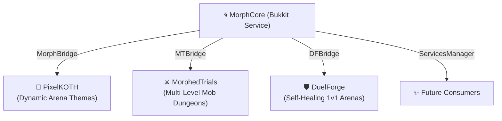

# 🌀 MorphCore

> **High-Performance Procedural Arena-Morphing & World Transition Engine for Paper 1.21+**  
> *Transform entire Minecraft arenas, dungeons, and PvP battlefields in real-time with cinematic choreography, zero physics cascades, and diff-only block placement.*

---

## 🌟 Overview

**MorphCore** is a specialized Minecraft arena animation engine built natively for Paper 1.21+. It seamlessly animates a 3D cuboid region from one captured block and display-entity state to another.

Instead of clearing regions or dropping massive schematic pastes that freeze the main thread and trigger cascading block updates, MorphCore computes the **mathematical difference (diff)** between the existing build and the target build. Only cells that actually change are scheduled for placement through configurable per-tick budgets, physics-suppressed placement pipelines, and rich mathematical choreographies.

MorphCore is **snapshot-format-agnostic**: it never reads or writes proprietary file formats directly. Instead, consumer plugins supply a lightweight `MorphGrid` (palette-compressed blocks + bounds) and a list of `MorphDisplay` entities, and MorphCore handles the real-time execution, scheduling, player interactions, and cosmetic spectacles.

---

## 🚀 Key Features

### ⚡ Diff-Only Block Placement Engine
* **Precision Delta Engine:** Cells that are identical in both source and destination states are completely untouched. Air carving and block materialization are both treated as discrete diff operations.
* **Zero Physics Cascades:** Sand, gravel, water, lava, and redstone do not cascade mid-morph. Physics is disabled during transition ticks to maintain server performance and structural integrity.
* **Palette Compression & Budgeting:** Block states are compressed into fast numeric palettes. Configurable per-tick placement caps prevent TPS drops even across multi-million block arenas.
* **Entity Protection & Safe-Landing:** Ground-up rising styles (`RISE`) automatically launch and reposition players caught in emerging structures to prevent suffocation.

### 🎭 14+ Procedural Choreographies & Styles
MorphCore provides a wide selection of animation choreographies driven by simplex noise, cellular automata, and geometry:

| Style | Description | Visual Character |
| :--- | :--- | :--- |
| **`SWEEP`** | Concentric circular wave expanding from center to perimeter | Clean, classical, geometric ring reveal |
| **`SPREAD`** | 2D/3D Simplex noise-perturbed organic front | Irregular creeping lobes, biological overgrowth |
| **`RIFT`** | Space-time tear along a jagged diagonal seam | Dimensional tear bleeding outward from a central seam |
| **`METEOR`** | Staggered falling meteor shower | Impact fireballs that splatter and coalesce into the new build |
| **`VEINS`** | Ridged fractal noise tendrils crawling outward | Living corruption spreading like blood vessels or roots |
| **`SPIRAL`** | Logarithmic vortex winding from center outward | Black hole gravitational swirl |
| **`RAIN`** | Vertical cascading streams from ceiling to floor | Digital matrix datafall |
| **`LIFE`** | Conway’s Game of Life cellular automaton | Evolving mathematical glider patterns revealing blocks |
| **`COLLAPSE`**| Reverse implosion closing from outer edges to center | Collapsing energy field pulling in the terrain |
| **`SHATTER`** | Voronoi crystalline polygon bursts | Shattered glass shards snapping into alignment |
| **`RISE`** | Bottom-up tectonic emergence | Erupting monoliths and towers pushing up from underground |
| **`ERUPTION`**| Violent volcanic upheaval with flame bursts | High-velocity seismic elevation |
| **`GEYSER`**  | High-pressure vertical water/steam jets | Hydrothermal bursting pillars |
| **`UPHEAVAL`**| Craggy subterranean plate shift | Earth-shattering tectonic rise |

### 🔮 Display Entity Integration
* Seamlessly supports **Text Displays**, **Item Displays**, and **Block Displays** (1.19.4+ display entities).
* Entities are tracked with a custom namespaced PersistentDataContainer (`ownerKeyId`).
* MorphCore smoothly retires old displays and triggers consumer spawner callbacks to introduce new displays without orphan entity leaks.

### 🎆 Cinematic Spectacle & FX Layer
* **Boss Bars:** Real-time morph progress bar with custom colors, styles, and countdown timers.
* **Title Cards:** Dynamic screen titles and subtitles announcing phase or theme shifts.
* **Environmental Atmospheric FX:** Lightning strikes, shockwaves, smoke plumes, portal particles, and sky tinting.
* **Directional Audio:** Coordinated sound effects mapped to impact locations and sweep fronts.
* **Completion Fireworks:** Synchronized celebratory pyrotechnics upon transformation completion.

---

## 🏛 Ecosystem: Consumer Plugins

MorphCore acts as the core procedural animation service for the Servereer plugin ecosystem:



### 1. 👑 [PixelKOTH](https://github.com/scrunc/pixelkoth)
* **Use Case:** King of the Hill arena theme switching.
* **Functionality:** When a KOTH event begins or changes phases (e.g., normal hill to corrupted obsidian fortress), MorphCore sweeps the new arena theme into place. When the round concludes, the arena restores back to its pristine resting base.

### 2. ⚔️ MorphedTrials
* **Use Case:** Party-based rogue-like dungeon crawler on a single physical region.
* **Functionality:** A dungeon party clears waves of hostile mobs in a room. Upon clearing the room and stepping onto the exit pad, MorphCore morphs the entire physical box into Floor 2, Floor 3, and beyond without requiring separate worlds or coordinate teleports.

### 3. 🛡️ DuelForge
* **Use Case:** 1v1 competitive PvP arenas with self-healing resets.
* **Functionality:** After intense duels involving explosions, fire, block breaking, or griefing, MorphCore diffs the damaged live arena against the pristine snapshot and repairs only the broken blocks using a rapid repair choreography. Also powers dynamic arena map rotation.

---

## 💻 Developer API & Integration

MorphCore registers as a Bukkit service under `dev.servereer.morphcore.MorphCore`.

### 1. Dependency Configuration

#### Gradle (`build.gradle.kts`):
```kotlin
repositories {
    mavenLocal() // Published via ./gradlew publishToMavenLocal
}

dependencies {
    compileOnly("dev.servereer:morphcore:1.0.0")
}
```

#### Maven (`pom.xml`):
```xml
<dependency>
    <groupId>dev.servereer</groupId>
    <artifactId>morphcore</artifactId>
    <version>1.0.0</version>
    <scope>provided</scope>
</dependency>
```

#### `plugin.yml`:
```yaml
# Use softdepend so your plugin still loads if MorphCore is absent
softdepend: [MorphCore]
```

---

### 2. Safe Bridge Pattern

To ensure your plugin never throws `NoClassDefFoundError` when MorphCore is absent, isolate all MorphCore class references inside a dedicated bridge class:

```java
public class MorphBridge {

    public interface Handle {
        void cancel();
        boolean isRunning();
    }

    public static boolean isAvailable() {
        return Bukkit.getPluginManager().isPluginEnabled("MorphCore") &&
               Bukkit.getServicesManager().load(MorphCore.class) != null;
    }

    public static Handle startMorph(Plugin plugin, MorphGrid target, MorphGrid compare,
                                    int seconds, MorphSpec spec, MorphSettings settings,
                                    Runnable onComplete) {
        MorphCore core = Bukkit.getServicesManager().load(MorphCore.class);
        if (core == null) return null;

        ArenaMorph morph = core.morph(plugin, target, compare, seconds, spec, settings, "myplugin");
        morph.start(onComplete);

        return new Handle() {
            @Override public void cancel() { morph.cancel(); }
            @Override public boolean isRunning() { return morph.isRunning(); }
        };
    }
}
```

---

### 3. Executing a Morph

```java
// 1. Build a MorphGrid from your own snapshot format
MorphGrid targetGrid = mySnapshot.toMorphGrid();
MorphGrid currentGrid = myCurrentState.toMorphGrid();

// 2. Resolve settings and spec
MorphSettings settings = MorphSettings.resolve(myConfigSection);
MorphSpec spec = MorphSpec.resolve(myConfigSection, templateOverrides);

// 3. Initiate the morph
MorphBridge.startMorph(this, targetGrid, currentGrid, 30, spec, settings, () -> {
    getLogger().info("Arena transformation complete!");
});
```

---

## ⚙️ Style Pack Configuration (`morphs/*.yml`)

MorphCore packs live under `plugins/MorphCore/morphs/`. Each file defines the choreography style, noise parameters, and cosmetic spectacle settings:

```yaml
style: METEOR
display-name: "&6&lMeteor Shower"
icon: FIRE_CHARGE
lore:
  - "&7Blazing meteors rain down from the sky,"
  - "&7transforming the battlefield on impact."

meteor:
  count: 0             # 0 = auto-calculated based on arena volume
  spawn-height: 45     # Blocks above the highest arena block
  travel-ticks: 35     # Fall duration per meteor
  order: RANDOM        # RANDOM, CENTER_OUT, or EDGES_FIRST
  sound: ENTITY_DRAGON_FIREBALL_EXPLODE

organic:
  amplitude: 6.5       # Noise displacement reach
  scale: 0.08          # Noise granularity
  warp: 2.5            # Domain-warp curvature

fx:
  boss-bar:
    enabled: true
    title: "&eTransforming Arena: &6<style>"
    color: YELLOW
    style: SEGMENTED_10
  title:
    enabled: true
    title: "&c&lARENA MORPH"
    subtitle: "&7Brace for impact!"
    fade-in: 10
    stay: 40
    fade-out: 10
  lightning: true
  shockwave: true
  completion-firework: true
```

---

## 🛠️ Building & Deploying

### Prerequisites
* Java 21 JDK
* Gradle (wrapper included)

### Commands
```bash
# Build standalone jar
./gradlew build

# Publish API artifact to local maven repository for consumer plugins
./gradlew publishToMavenLocal
```

Compiled jar will be located at:
`build/libs/MorphCore-1.0.0.jar`

---

## 📄 License & Credits
Developed by **servereer** as part of the modular server architecture. Open license for server network internal services.
